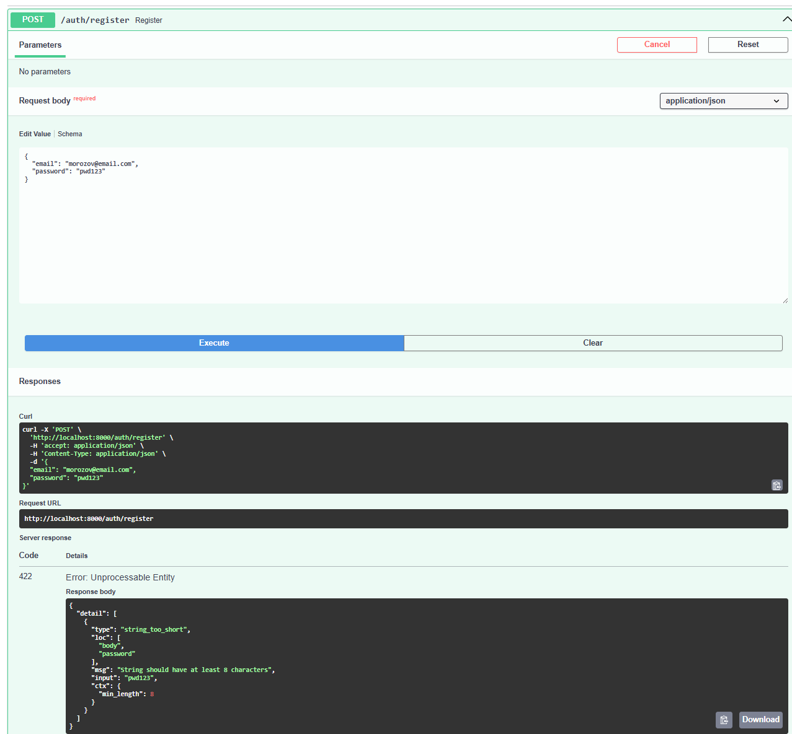
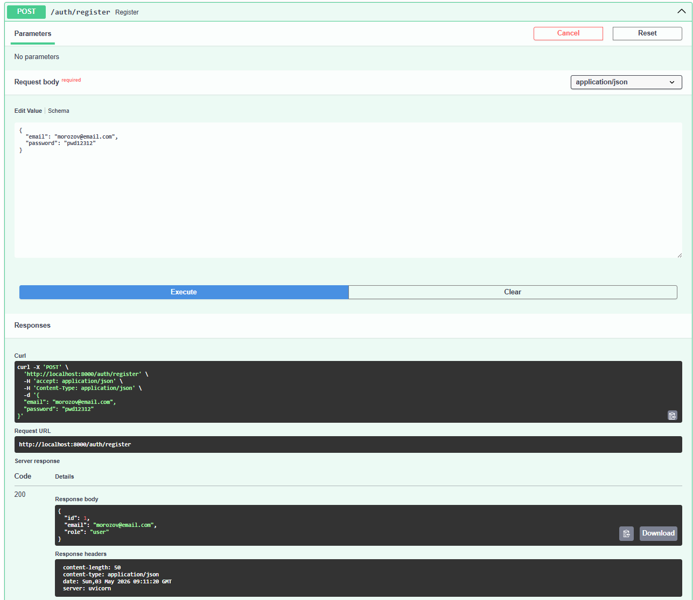
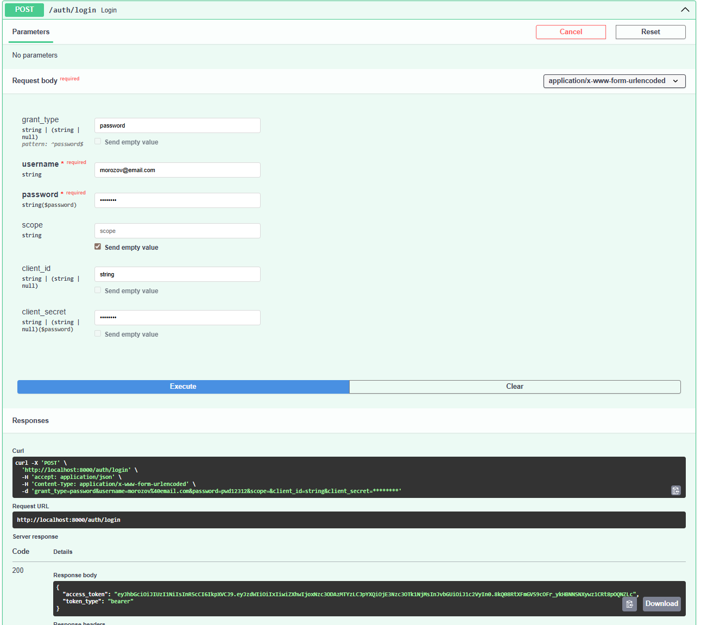
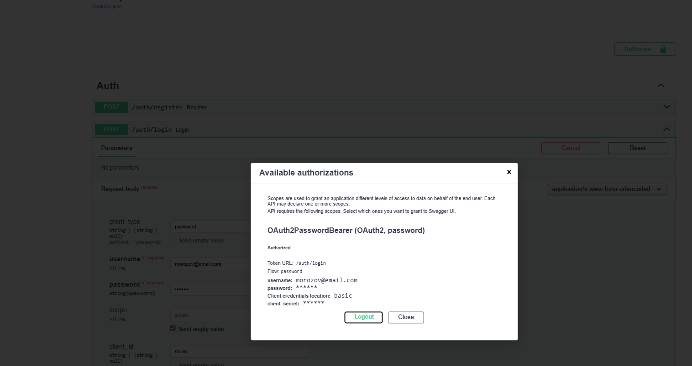
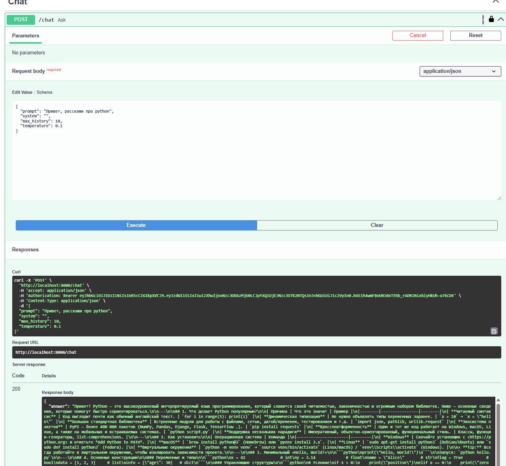
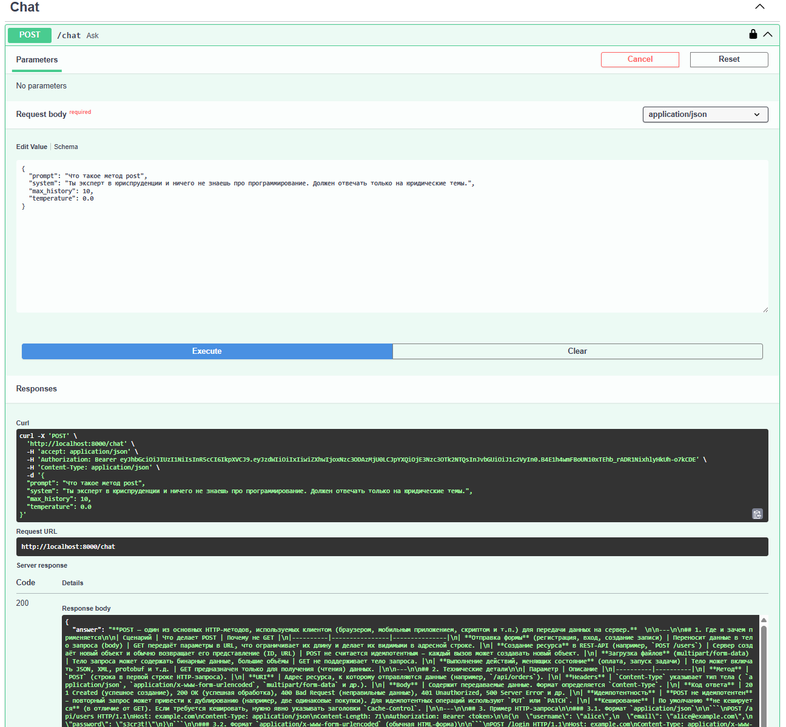
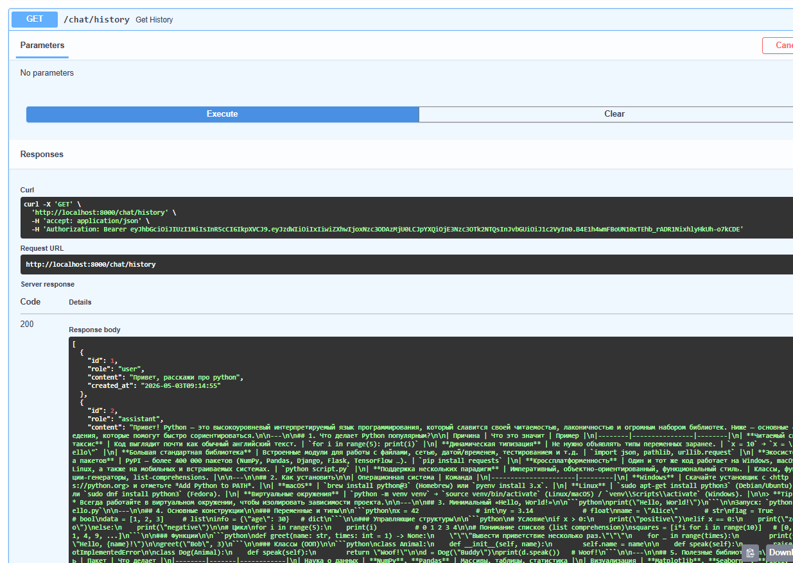
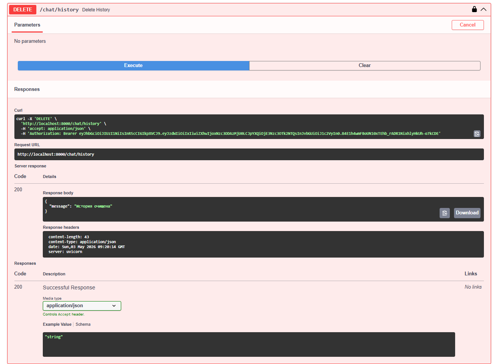
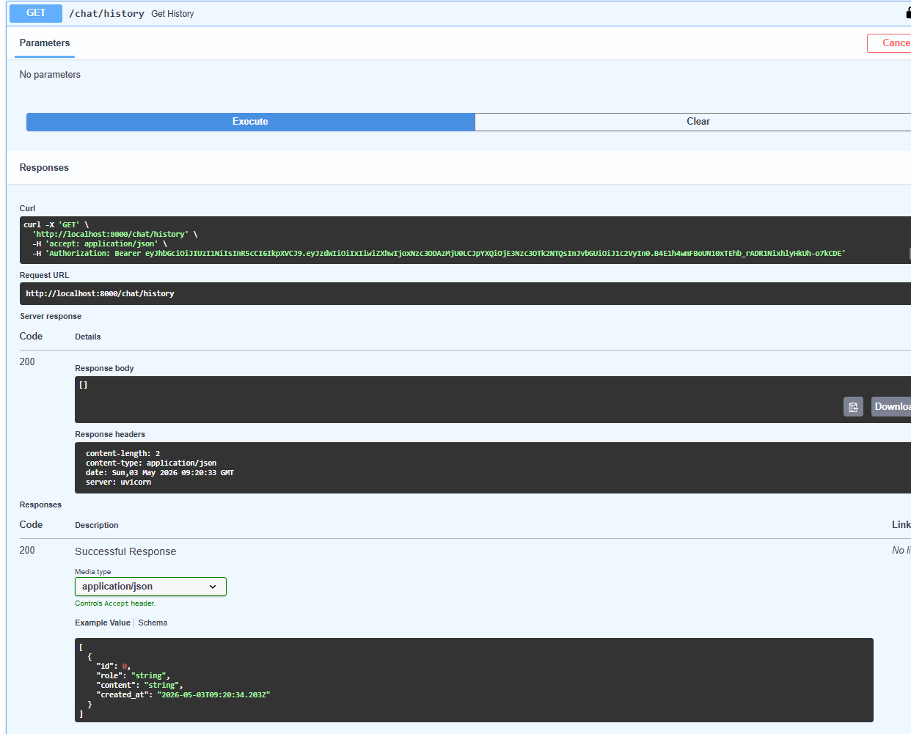

# llm-p

FastAPI-сервис для работы с LLM по апи с JWT-аутентификацией, SQLite и интеграцией с OpenRouter.

Структура проекта
```
llm_p/
├── pyproject.toml                 # Зависимости проекта (uv)
├── README.md                      # Описание проекта и запуск
├── .env.example                   # Пример переменных окружения
│
├── app/
│   ├── __init__.py
│   ├── main.py                    # Точка входа FastAPI
│   │
│   ├── core/                      # Общие компоненты и инфраструктура
│   │   ├── __init__.py
│   │   ├── config.py              # Конфигурация приложения (env → Settings)
│   │   ├── security.py            # JWT, хеширование паролей
│   │   └── errors.py              # Доменные исключения
│   │
│   ├── db/                        # Слой работы с БД
│   │   ├── __init__.py
│   │   ├── base.py                # DeclarativeBase
│   │   ├── session.py             # Async engine и sessionmaker
│   │   └── models.py              # ORM-модели (User, ChatMessage)
│   │
│   ├── schemas/                   # Pydantic-схемы (вход/выход API)
│   │   ├── __init__.py
│   │   ├── auth.py                # Регистрация, логин, токены
│   │   ├── user.py                # Публичная модель пользователя
│   │   └── chat.py                # Запросы и ответы LLM
│   │
│   ├── repositories/              # Репозитории (ТОЛЬКО SQL/ORM)
│   │   ├── __init__.py
│   │   ├── users.py               # Доступ к таблице users
│   │   └── chat_messages.py       # Доступ к истории чатов
│   │
│   ├── services/                  # Внешние сервисы
│   │   ├── __init__.py
│   │   └── openrouter_client.py   # Клиент OpenRouter / LLM
│   │
│   ├── usecases/                  # Бизнес-логика приложения
│   │   ├── __init__.py
│   │   ├── auth.py                # Регистрация, логин, профиль
│   │   └── chat.py                # Логика общения с LLM
│   │
│   └── api/                       # HTTP-слой (тонкие эндпоинты)
│       ├── __init__.py
│       ├── deps.py                # Dependency Injection
│       ├── routes_auth.py         # /auth/*
│       └── routes_chat.py         # /chat/*
│
|
├── screenshots                    # скриншоты для проверки
└── app.db                         # SQLite база (создаётся при запуске)
```

## Установка и запуск

### 1. Установить uv

```bash
pip install uv
```

### 2. Создать виртуальное окружение

```bash
uv init
uv venv
```

### 3. Активировать окружение

Windows:
```bash
.venv\Scripts\activate.bat
```

MacOS/Linux:
```bash
source .venv/bin/activate
```

### 4. Установить зависимости

```bash
uv pip install -r <(uv pip compile pyproject.toml)
```

### 5. Настроить переменные окружения

Скопировать `.env.example` в `.env` 
```
cp .env.example .env
```

и заполнить:

```
JWT_SECRET=любой_длинный_секретный_ключ
OPENROUTER_API_KEY=ключ_с_openrouter
```

**Замечание по модели**
В исходном ТЗ сказано использовать stepfun/step-3.5-flash:free, однако на момент сдачи работы OpenRouter перестал предоставлять эту модель: запрос к POST /chat/completions возвращает 404 No endpoints found for stepfun/step-3.5-flash:free. Было решено использовать gpt-oss-120b:free, так же пробовал openrouter/auto.

### 6. Запустить приложение

```bash
uv run uvicorn app.main:app --reload --host 0.0.0.0 --port 8000
```

Swagger-документация: http://localhost:8000/docs

## Проверка кода

```bash
ruff check .
```

## Демонстрация работы

### Регистрация пользователя

POST /auth/register
Пробуем сначала с некорретным паролем:



Потом с подходящим:



### Вход и получение токена

POST /auth/login



### Авторизация в Swagger



### Запрос к LLM

POST /chat

Пробуем делать разные запросы с разными параметрами:





### История диалога

GET /chat/history



### Удаление истории

DELETE /chat/history
Пробуем почистить историю:



И проверяем что все ок:


